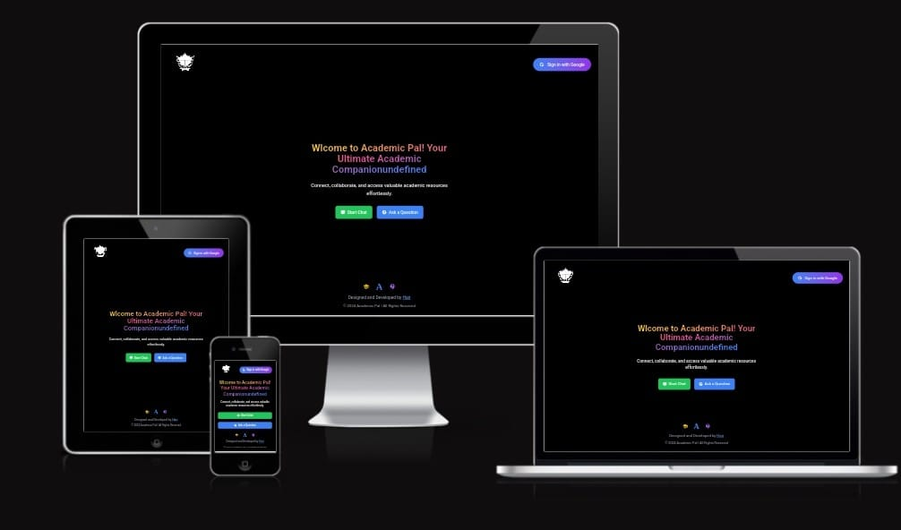

# 📱 Chat Application - Powered by Academic pal

! <!-- Replace this link with your actual image URL -->

Welcome to the **Chat Application** powered by Firebase! This app allows users to send and receive messages in real-time. It's built with **React.js**, **Firebase**, and **Socket.io** for seamless communication.

---

## 🚀 Features

- **Real-time Messaging**: Send and receive messages instantly with the help of **Socket.io**.
- **User Authentication**: Secure and easy login with **Google Authentication** using **Firebase**.
- **File Upload**: Attach and share files with **Firebase Storage**.
- **Responsive Design**: Optimized for both desktop and mobile devices using **Tailwind CSS**.

---

## 🖥 Frontend Technologies

Here are the main technologies used in building the **frontend** of the application:

- **React.js** : A JavaScript library for building user interfaces.
- **Tailwind CSS** : A utility-first CSS framework for styling the app.
- **Framer Motion** : A motion library for animations and transitions.
- **React Icons** : A library to add icons in React apps.
- **Firebase Authentication** : For authentication and real-time database.

---

## ⚙️ Backend Technologies

Here are the core technologies used in the **backend**:

- **Firebase Firestore** : NoSQL cloud database to store and manage chat data.
- **Firebase Storage** : Cloud storage for handling file uploads.
- **Socket.io** : For real-time, bidirectional communication between client and server.
- **Node.js** : JavaScript runtime for building the backend services.

---

## 💻 Setup Instructions

### Prerequisites

Before running the project, make sure you have the following installed on your system:

- **Node.js** (Version 14 or higher)
- **npm** (Node Package Manager)

### 1. Clone the Repository

```bash
git clone https://github.com/your-username/chat-app.git
cd chat-app
